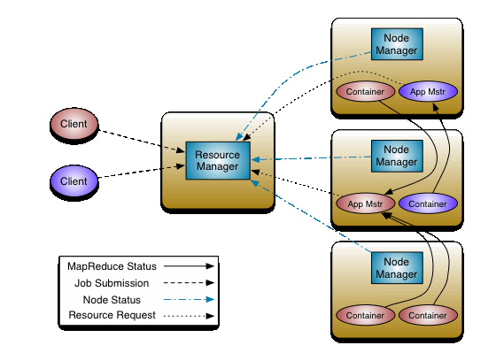

## YARN Container

### What is a container in YARN
- It represents a collection of physical resources, i.e., CPU cores, disk along with RAM.
- When an application is about to get submitted into the YARN platform, the `yarn-client` allocates a container from the ResourceManager, where its `ApplicationMaster` will run. (container 0)

- After the ApplicationMaster gets started, it should request for more containers to deploy the tasks and to actually start the application. 

### Container resource allocation
- CPU: A node's capacity should be configured with virtual cores equal to its number of physical cores
