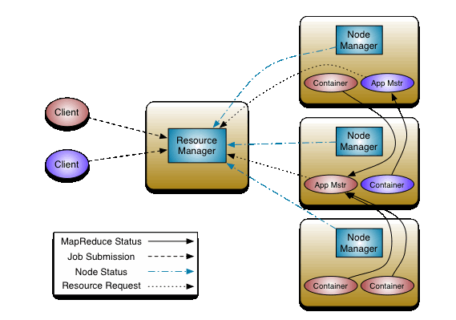

## Yarn

### YARN Components
- `Client`: which submit the MapReduce job
- `Resource Manager`: which manages the use of resources across the cluster. It creates new containers for Map and Resurce process.
- `Node Manager`: In every new container created by Resource Manager, a Node Manager process will be run which oversees the containers running on the cluster nodes. It doesn't matter if the container is created for Map or Reduce or any other process. Node Manager ensures that the application does not user mroe resources than what it is allocated with.
- `Application Master`: which negotiates with the Resource Manager for resource s and runs the application-specific process (Map or Reduce tasks) in those clusters. The Application Master & the MapReduce tasks run in containers that are scheduled by the Resource Manager and managed by the Node Manager.
- [ref](http://www.slideshare.net/rajeshanandakumar/anatomy-of-yarn-hadoop)

### Spark Yarn 
- `Applciation`: This may be a single job, a sequence of jobs, a long-running service issuing new commands a needed or an interative exploration session.
- `Spark Driver`: The Spark driver is the process running the spark context (which represents the application session). This driver is responsible for converting the application to a directed graph of individual steps to execute on the cluster. There is one driver per application.
  - The driver program is responsible for managing the job flow and scheduling tasks that will run on the executors.
- `Spark Application Master`: The Spark Application Master is responsible for negotiating resource requests made by the driver with YARN and finding a suitable set of hosts/containers in which to run the Spark applications. There is one Application Master per application.
- `Spark Executor`: A single JVM instance on a node that servers a single Spark application, An executor runs multiple tasks over its lifetime, and multiple tasks concurrently. A node may have several Spark executors and there are many nodes running Spark Executors for each client application.
  - Excutors are processes that run computation and store data for a Spark application.
- `Spark Task`: A Spark Task represents a unit of work on a partition of a distributed dataset.
- [ref](http://blog.cloudera.com/blog/2014/05/apache-spark-resource-management-and-yarn-app-models/)

### Spark Architecture
- `Driver Program`: the driver program is responsible for managing the job flow and scheudling tasks that will run on the executors.
- `Executors`: executors are processes that run computation and store data for a Spark application.
- `Cluster Manager`: Cluster Manager is responsible for starting executor processes and where and when they wil lrun. Spark supports plggable cluster manager, it supports (YARN, Mesos, and its own "standalone` cluster manager)
- [ref](http://badrit.com/blog/2015/2/29/running-spark-on-yarn#.VbJ46bNVhBc)

### YARN Architecture
- `Resource Manager`: manages the user of resource s across the cluster.
- `Node Manager`: launches and monitors containers on cluster machines.
- `Application Master`: manages the lifecycle of an application running on the cluster.
- `Container`: It represents a collection of physical resource (CPU cores + memory) on a single node at a cluster. Those resoruce are allocated for the user of a worker slave.
- [ref](http://badrit.com/blog/2015/2/29/running-spark-on-yarn#.VbJ46bNVhBc)

### [Yarn Container](./files/container.md)

### [Spark on Yarn](./files/spark-on-yarn.md)
